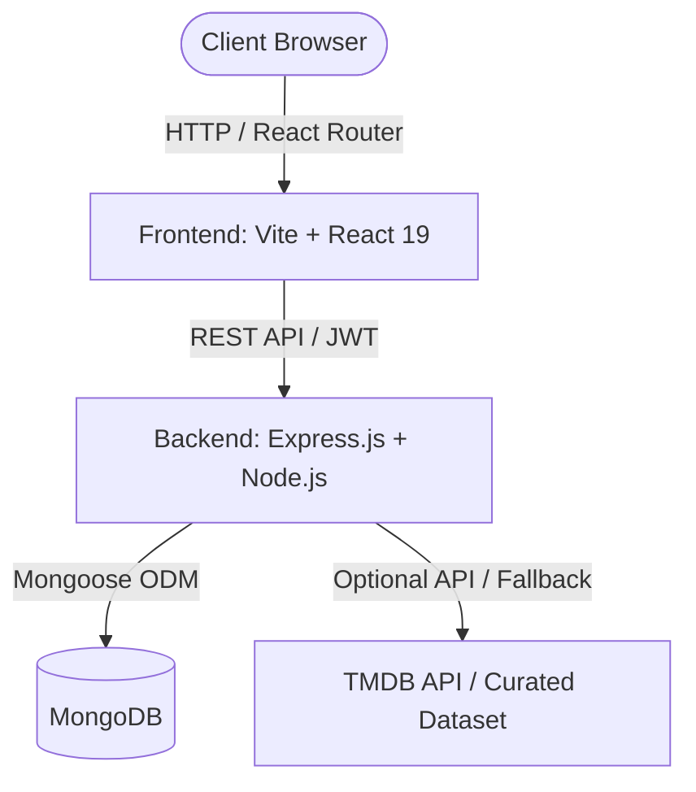

# 🎬 MovieMate – Full-Stack Movie Review & Recommendation Platform

> A full-stack web application for discovering curated Indian cinema, rating movies, posting community reviews, managing personal watchlists, and exploring personalized recommendations.

[](https://github.com/Crispy-0912/Fsd_movie/actions/workflows/deploy.yml)
[](https://github.com/Crispy-0912/Fsd_movie)

---

## 🌟 Key Features

- **Curated Multi-Industry Indian Cinema**: 100 hand-picked blockbuster & critically acclaimed titles across Telugu (25), Hindi (20), Tamil (20), Malayalam (15), Kannada (10), and Bengali (10).
- **Search & Filter Engine**: Real-time title search, genre filters, and sort options (Top Rated, Popularity, Release Date, Title).
- **Interactive Ratings & Reviews**: 1–5 star interactive rating system, community reviews with like/unlike counters and edit/delete permissions.
- **Personal Watchlist**: Authenticated users can bookmark titles to watch later with instant synchronization.
- **User Authentication**: Secure JWT-based registration and login with bcrypt password hashing.
- **Glassmorphism Dark UI**: Cyber-luxe aesthetic built with custom CSS, fluid animations, and Lucide icons.
- **Continuous Deployment**: Automated build and deployment to GitHub Pages via GitHub Actions.

---

## 🏗️ Architecture & Tech Stack



### Frontend
- **Framework**: React 19 + Vite
- **Routing**: React Router v7
- **Styling**: Modern Glassmorphic Vanilla CSS (HSL dark mode palette)
- **Icons**: Lucide React
- **Data Visualization**: Recharts

### Backend
- **Runtime**: Node.js & Express.js
- **Database**: MongoDB with Mongoose ODM
- **Authentication**: JWT (JSON Web Tokens) & bcryptjs
- **Security**: CORS, Express Rate Limit, Input Sanitization
- **Services**: TMDB API integration with embedded offline curated catalog fallback

---

## 📁 Repository Structure

```
.
├── .github/
│   └── workflows/
│       └── deploy.yml          # GitHub Actions workflow for GitHub Pages
├── backend/
│   ├── config/                 # Database configuration
│   ├── controllers/            # Route controllers (Auth, Movies, Ratings, Reviews, Watchlist)
│   ├── data/                   # Curated Indian movies dataset (100 movies)
│   ├── middleware/             # Auth JWT verification & error handling
│   ├── models/                 # Mongoose schemas (User, Review, Rating, Watchlist)
│   ├── routes/                 # Express API routes
│   ├── services/               # TMDB service with curated fallback
│   ├── server.js               # Express application entry point
│   ├── package.json
│   └── .env.example
├── frontend/
│   ├── src/
│   │   ├── components/         # Reusable UI components (MovieCard, RatingStars, ReviewForm, Navbar, etc.)
│   │   ├── context/            # AuthContext (state & JWT token management)
│   │   ├── pages/              # Views (Home, Movies, MovieDetails, Login, Register, Profile, Watchlist, MyReviews)
│   │   ├── services/           # Axios instance & API client
│   │   ├── App.jsx             # App routing & providers
│   │   └── main.jsx
│   ├── index.html
│   ├── vite.config.js          # Vite configuration with GitHub Pages base path
│   ├── package.json
│   └── .env.example
├── .gitignore
├── .env.example
└── README.md
```

---

## 🚀 Getting Started Locally

### Prerequisites
- Node.js (v18 or higher)
- MongoDB installed locally or a free [MongoDB Atlas](https://www.mongodb.com/cloud/atlas) cluster connection string.

### 1. Clone the Repository
```bash
git clone https://github.com/Crispy-0912/Fsd_movie.git
cd Fsd_movie
```

### 2. Configure Environment Variables

**Backend (`backend/.env`):**
```env
PORT=5000
MONGODB_URI=mongodb://127.0.0.1:27017/moviemate
JWT_SECRET=your_jwt_secret_key_here
CLIENT_URL=http://localhost:5173
TMDB_API_KEY=               # Optional (curated dataset operates without key)
NODE_ENV=development
```

**Frontend (`frontend/.env`):**
```env
VITE_API_BASE_URL=http://localhost:5000/api
```

### 3. Run Backend
```bash
cd backend
npm install
npm run dev
```
Backend API will start at: `http://localhost:5000` (Health check: `http://localhost:5000/api/health`)

### 4. Run Frontend
```bash
cd frontend
npm install
npm run dev
```
Frontend development server will open at: `http://localhost:5173`

---

## 🌐 Deployment Guide

### 1. Frontend: Deploying to GitHub Pages (Automated)

This repository includes a pre-configured GitHub Actions workflow in [`.github/workflows/deploy.yml`](.github/workflows/deploy.yml).

To activate it:
1. Navigate to your GitHub repository: [Crispy-0912/Fsd_movie](https://github.com/Crispy-0912/Fsd_movie)
2. Go to **Settings** > **Pages**.
3. Under **Build and deployment** > **Source**, select **GitHub Actions**.
4. Push your commits to `main` branch.
5. The workflow will automatically trigger, build the frontend, and deploy it to:
   ```
   https://crispy-0912.github.io/Fsd_movie/
   ```

### 2. Backend: Deploying to Render / Railway / Fly.io

Because GitHub Pages only serves static frontend files, host the Node.js backend on a free cloud provider:

#### Deploying on Render (Free Web Service):
1. Create a free account at [render.com](https://render.com).
2. Click **New +** > **Web Service** and connect repository `Crispy-0912/Fsd_movie`.
3. Set configuration:
   - **Root Directory**: `backend`
   - **Build Command**: `npm install`
   - **Start Command**: `node server.js`
4. In **Environment Variables**, add:
   - `MONGODB_URI`: Your MongoDB Atlas connection URI
   - `JWT_SECRET`: A secure random secret string
   - `CLIENT_URL`: `https://crispy-0912.github.io`
   - `NODE_ENV`: `production`
5. Once deployed, copy your Render backend URL (e.g. `https://moviemate-api.onrender.com`).
6. In `frontend/.env.production` or repository GitHub Secrets, set:
   ```
   VITE_API_BASE_URL=https://moviemate-api.onrender.com/api
   ```

---

## 👥 Authors & Academic Attribution
Developed as a Full-Stack Development (FSD) Project.
- GitHub: [@Crispy-0912](https://github.com/Crispy-0912)
